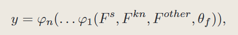

## 以往问题：

1.神经网络很难解释诊断结果，即很难明确一个学生在多大程度上掌握某一知识概念

## 相关工作

1.DINA、IRT，人工设计的函数，限制其应用范围

2.Matrix Factorization 矩阵分解，但隐潜在的向量不具有解释性

3.人工神经落落，DKT是第一次尝试可解释性

## NCD

符号假设：学生$S_N$，练习$e_M$，知识点$k_K$构成三元组$(s,e,r)$学生做题对错

问题定义：给定作答矩阵和矩阵，诊断任务没目标是通过学生表现得预测过程挖掘学生在只是概念上的能力

### 框架：

学生因素：考虑DINA相似的那种具体可解释向量，不是用的IRT那种潜在向量，使用$F_s$表示只是概念能力

练习因素：将只是因素分成两类，第一类表示练习与知识点的关系，因为我们需要把$F_s$ 对应元素都能反映知识点特征，称之为只是相关向量$F^{kn}$，与学生向量同维度。第二类是可选的，例如IRT、DINA中的只是难度、连续难度、区分度等

交互函数：

期中FS是学生向量表示，Fkn是知识点表示，Fother是其他特征，thetaf是模型参数，phii是神经网络中第i个的MLP

单调性假设：学生正确作答在知识点每个维度上都是单调增加的

在这些作答正确的学生中，模型预测学生做错，该模型仍然应该提高学生熟练度

### NCDM

学生factor：xs是学生的ont-hot向量，因此通过一层emmbedding得到hs (1\*K)

练习factor：xe是练习onthot，因此通过Q矩阵提取处相关知识点考察向量Qe (1\*K)

题目难度向量：利用题目onehot像两个xe，加一层embdding变成知识点难度hdiff (1\*K)

题目区分度：同上，embdding后维度是 hdisc (1\*1)

交互函数：考虑MIRT模型则公式写作x=Qe o( hs-hdiff)×hdisc   o是元素点乘，因此x的向量应该是一个(1\*K)

(此处注意解释Qe是Q向量，在点乘后向量只有部分位置有值，其他部分没有值，这不值得奇怪，因为这是一种覆盖了MF、IRT、MIRT的一般化模型)

然后通过两层隐藏全连接和输出层

神经网络中将参数都设定为整数来保证单调性

损失函数为交叉熵

## 实验

### 数据集：

有一个指标：AVG学生i回答题目与知识点相关的习题量的平均，反映一个学生做某个知识点相关题目量，越大越好，说明矩阵信息越丰富

还有一个DOA指标：模型可解释性，a学生比b学生对知识点k掌握更好，应该对k相关的题目回答更容易作对。在学生a比学生b号的情况下的所有情况中，在同时(J)作答了考察同一知识点的题目（I）且学生a回答比学生b还对（delta）

### 实验设置

两个隐藏层和输出层是512、256、1

激活函数使用sigmoid

初始化参数使用Xavier，

# 新的笔记

哈哈哈
